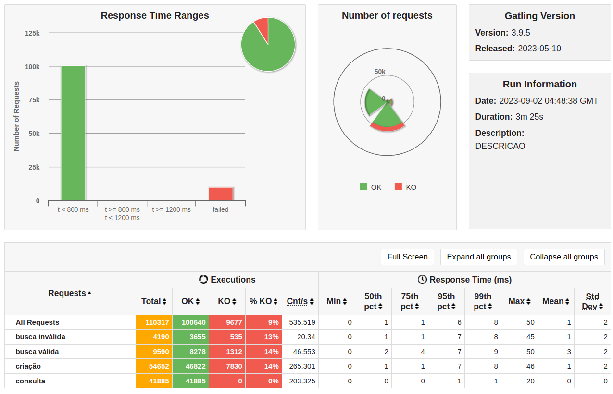
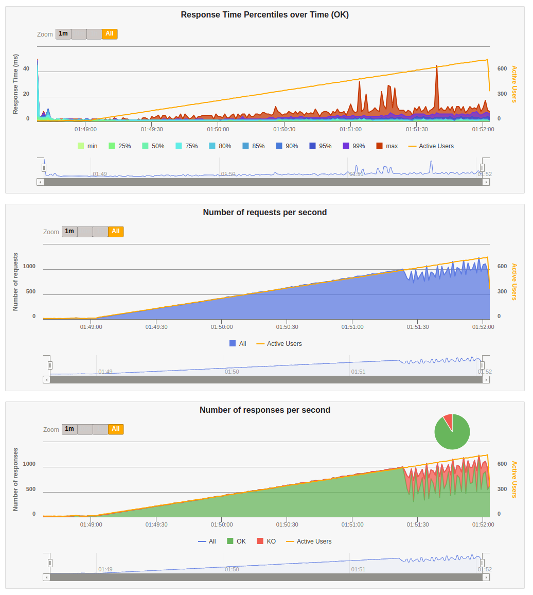

# rinhabackend_crystal

This is a project written using [Lucky](https://luckyframework.org), with the language Crystal.

The goal was to fulfill the requirements of the ["Rinha Backend - API Challenge"](https://github.com/zanfranceschi/rinha-de-backend-2023-q3/blob/main/INSTRUCOES.md).

The idea was to create a very simple set of API endpoints and run against a Gatling scenario stress-test, as per the instructions above.

You can use the "docker-compose.yml" provided to spin up the environment with the resource restrictions from the challenge and run the Gatling script against it.

When you want to run the stress test and monitor each container, you can use tmuxp to open htop to monitor the app, postgres, redis and nginx with:

    tmuxp load tmux-monitor.yaml

### Results

The official Top 1 result was from @viniciusfonseca and his Rust version clocking in around 40k inserts (the winning criteria).

The unofficial tie was from @MrPowerGamerBR and his Kotlin version also clocking in above the 40k mark.

This Crystal/Lucky version can max out at 47,000 inserts, making it either surpass or tie the above versions.

Moreover, both the Rust and Kotlin versions are bare-bones, whereas this version uses a full web framework in Lucky, so code is way prettier and more organized.

Click [here](https://github.com/zanfranceschi/rinha-de-backend-2023-q3/tree/main/stress-test) for the Gatling stress-test simulation script.

This is Gatling's results:

```
================================================================================
2023-09-02 00:44:05                                         205s elapsed
---- Requests ------------------------------------------------------------------
> Global                                                   (OK=100764 KO=9567  )
> busca inválida                                           (OK=3665   KO=525   )
> criação                                                  (OK=46892  KO=7742  )
> consulta                                                 (OK=41915  KO=2     )
> busca válida                                             (OK=8292   KO=1298  )
---- Errors --------------------------------------------------------------------
> j.i.IOException: Premature close                                 9565 (99.98%)
> status.find.in([200, 209], 304), found 404                          2 ( 0.02%)

---- Busca Inválida de Pessoas -------------------------------------------------
[##########################################################################]100%
          waiting: 0      / active: 0      / done: 4190  
---- Busca Válida de Pessoas ---------------------------------------------------
[##########################################################################]100%
          waiting: 0      / active: 0      / done: 9590  
---- Criação E Talvez Consulta de Pessoas --------------------------------------
[##########################################################################]100%
          waiting: 0      / active: 0      / done: 54634 
================================================================================

Simulation RinhaBackendSimulation completed in 205 seconds
Parsing log file(s)...
Parsing log file(s) done
Generating reports...

================================================================================
---- Global Information --------------------------------------------------------
> request count                                     110331 (OK=100764 KO=9567  )
> min response time                                      0 (OK=0      KO=1     )
> max response time                                     94 (OK=94     KO=26    )
> mean response time                                     1 (OK=1      KO=6     )
> std deviation                                          2 (OK=2      KO=2     )
> response time 50th percentile                          1 (OK=0      KO=6     )
> response time 75th percentile                          1 (OK=1      KO=7     )
> response time 95th percentile                          7 (OK=4      KO=8     )
> response time 99th percentile                          9 (OK=8      KO=10    )
> mean requests/sec                                535.587 (OK=489.146 KO=46.442)
---- Response Time Distribution ------------------------------------------------
> t < 800 ms                                        100764 ( 91%)
> 800 ms <= t < 1200 ms                                  0 (  0%)
> t >= 1200 ms                                           0 (  0%)
> failed                                              9567 (  9%)
---- Errors --------------------------------------------------------------------
> j.i.IOException: Premature close                                 9565 (99.98%)
> status.find.in([200, 209], 304), found 404                          2 ( 0.02%)
================================================================================
```





### Setting up the project

1. [Install required dependencies](https://luckyframework.org/guides/getting-started/installing#install-required-dependencies)
1. Update database settings in `config/database.cr`
1. Run `script/setup`
1. Run `lucky dev` to start the app

### Using Docker for development

1. [Install Docker](https://docs.docker.com/engine/install/)
1. Run `docker compose up -f dev-docker-compose.yml`

The Docker container will boot all of the necessary components needed to run your Lucky application.
To configure the container, update the `docker-compose.yml` file, and the `docker/development.dockerfile` file.


### Learning Lucky

Lucky uses the [Crystal](https://crystal-lang.org) programming language. You can learn about Lucky from the [Lucky Guides](https://luckyframework.org/guides/getting-started/why-lucky).
